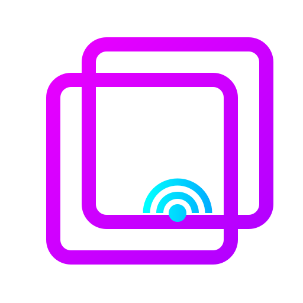

<!-- Source: ./README_MONOREPO_ROOT.md -->

# StreamGlass


<p align="center">
  
</p>

> 🚧 **Development Notice**: This repository is in an **early development phase** (pre-alpha). Expect frequent and potentially breaking changes. Not ready for production or general use but your feedback is more than welcome.

Streamer utilities for Twitch/OBS and any other software. Control your workstation with any device, from anywhere.
You can read more on the user documentation hosted on [https://docs.streamglass.io](https://docs.streamglass.io).

The streamglass project is organized as a monorepo.

- [StreamGlass: Frontend](./packages/frontend/README.md) - Available on [https://app.streamglass.io](https://app.streamglass.io)
- [StreamGlass: Server](./packages/server/README.md) - Available on [https://backend.streamglass.io](https://backend.streamglass.io)
- [StreamGlass: Utilities](./packages/sg-utilities/README.md)
- [StreamGlass: Desktop](./packages/desktop/README.md)

## Getting Started

```bash
# Install all dependencies
npm i
# Transpile the sg-uitlities library
npm tsc:build
# Start the server, desktop and frontend app in development mode.
npm run start
```

To build the electron deskop app, run:

```bash
npm run make
```

The binary can be found in `packages/desktop/out`.


<!-- Source: ./packages/frontend/README.md -->

## StreamGlass: Frontend

This is the main web-application.

| Statements                  | Branches                | Functions                 | Lines             |
| --------------------------- | ----------------------- | ------------------------- | ----------------- |
|  |  |  |  |


<!-- Source: ./packages/server/README.md -->

## StreamGlass: Server

This is an optional server component that provides additional functionalities.

| Statements                  | Branches                | Functions                 | Lines             |
| --------------------------- | ----------------------- | ------------------------- | ----------------- |
|  |  |  |  |


<!-- Source: ./packages/sg-utilities/README.md -->

## Stramglass: Utilities

| Statements                  | Branches                | Functions                 | Lines             |
| --------------------------- | ----------------------- | ------------------------- | ----------------- |
|  |  |  |  |

Utility to concatenate mardown files.

Usage:

```bash
md-concat -i <files...> -o <output> [-s <shift>]

Options:
      --version  Show version number                                   [boolean]
  -i, --input    Input markdown files                         [array] [required]
  -o, --output   Output file path                            [string] [required]
  -s, --shift    Heading shift level                       [number] [default: 1]
      --help     Show help                                             [boolean]
```

```bash
tsx packages/sg-utilities/src/markdown-util.ts --input ./README_MONOREPO_ROOT.md ./packages/frontend/README.md ./packages/server/README.md ./packages/sg-utilities/README.md --output ./README.md
```


<!-- Source: ./packages/desktop/README.md -->

## StreamGlass: Desktop

This is the desktop application that controls your computer.

| Statements                  | Branches                | Functions                 | Lines             |
| --------------------------- | ----------------------- | ------------------------- | ----------------- |
|  |  |  |  |

### Developing with WSL

To run electron on WSL2 we need some dependencies. For a standard ubuntu installation the following command should work:

```bash
sudo apt install libgconf-2-4 libatk1.0-0 libatk-bridge2.0-0 libgdk-pixbuf2.0-0 libgtk-3-0 libgbm-dev libnss3-dev libxss-dev
```

Check out more [wsl quirks](https://www.electronforge.io/guides/developing-with-wsl) here.

If you're using Windows Subsystem for Linux (WSL), there are some quirks to running Electron apps. Since you can run a mostly complete Linux distribution inside it, it justifiably declares itself as Linux when you're inside of it. However, as of February 2021 there is no support for running graphical apps compiled for Linux out of the box. Simply trying to run an Electron app in development that you've installed dependencies in WSL will try and fail to find an X11 server, and thus not launch.

Fortunately, one of the features of WSL is that you can run Windows executables from a WSL terminal seamlessly. The caveat is that you'll need to reinstall Electron in order to pick up the prebuilt binaries for Windows instead of Linux. Inside a WSL terminal, assuming that you've installed Node.js for Linux, you can run:

```bash
## If node_modules exists already that was installed in WSL:

rm -r node_modules

## then:

npm install --platform=win32

## or:

npm_config_platform=win32 npm install
```

Also make sure to have installed these dependencies:

```bash
sudo apt install dpkg fakeroot rpm
```