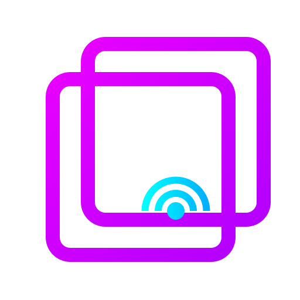

# StreamGlass


<p align="center">
  
</p>

> 🚧 **Development Notice**: This repository is in an **early development phase** (pre-alpha). Expect frequent and potentially breaking changes. Not ready for production or general use but your feedback is more than welcome.

Streamer utilities for Twitch/OBS and any other software. Control your workstation with any device, from anywhere.
You can read more on the user documentation hosted on [https://docs.streamglass.io](https://docs.streamglass.io).

The streamglass project is organized as a monorepo.

- [StreamGlass: Frontend](./packages/frontend/README.md) - Available on [https://app.streamglass.io](https://app.streamglass.io)
- [StreamGlass: Server](./packages/server/README.md) - Available on [https://backend.streamglass.io](https://backend.streamglass.io)
- [StreamGlass: Utilities](./packages/sg-utilities/README.md)
- [StreamGlass: Desktop](./packages/desktop/README.md) - Download it from the [Github Release Page](https://github.com/ggcaponetto/streamglass/releases)

## Getting Started

```bash
# Install all dependencies
npm i
# Transpile the sg-uitlities library
npm tsc:build
# Start the server, desktop and frontend app in development mode.
npm run start
```

To build the electron deskop app, run:

```bash
npm run make
```

The binary can be found in `packages/desktop/out`.

### Architecture and diagrams

````text
                              +-----------------------+
                              |  Web Browser Client   |
                              |   (Front-end UI)      |
                              +-----------------------+
                                        ⇅
                                    Socket.IO
                                        ⇅
                              +-----------------------+
                              |   Socket.IO Server    |
                              |   (Central Relay)     |
                              +-----------------------+
                                        ⇅
                                    Socket.IO
                                        ⇅
                              +---------------------------+
                              |   Desktop Electron App    |
                              | (Local Controller on PC)  |
                              +---------------------------+
````

Diagram: The high-level architecture of StreamGlass. This diagram shows how the web browser clients (running the StreamGlass front-end UI) connect over the internet to a central Socket.IO server, which in turn connects to the Electron-based desktop app running on the streamer’s PC. The Socket.IO server acts as a real-time relay between the browser and desktop, enabling users to control your workstation with any device, from anywhere​.
In practice, multiple browser clients can connect to the central server, and each streamer’s desktop app also maintains a persistent Socket.IO connection to that server. This design decouples the UI from the local machine control, with the server brokering messages between them​.

